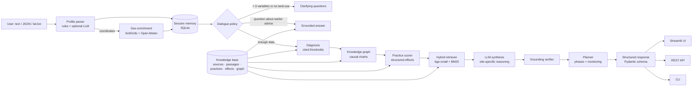

# Architecture — Darukaa.Earth AI Environmental Scientist

This document explains **how the system works and why it is built this way**. It is written so that
you can walk an evaluator through it component by component.

---

## 1. The one-sentence idea

> The LLM is **not** the source of knowledge. A structured, cited knowledge base plus a rule-based
> reasoning engine decide *what* to recommend; retrieval supplies the evidence; the LLM only
> explains the reasoning for the specific site, and a verifier deletes anything it cannot ground.

This directly answers the brief's constraints: *"No generic LLM-only solutions"* and *"Must demonstrate
knowledge grounding + reasoning."*

---

## 2. High-level diagram



---

## 3. Components

| # | Component | File | What it does |
|---|-----------|------|--------------|
| 1 | **Knowledge files** | `data/knowledge/*.yaml` | Human-readable, version-controlled scientific knowledge (see §4). |
| 2 | **KB build pipeline** | `darukaa/kb/build.py` | Validates every cross-reference, ingests optional PDFs, writes SQLite, embeds passages. Rebuilds automatically when a knowledge file changes (content fingerprint). |
| 3 | **Knowledge store** | `darukaa/kb/store.py` | SQLite schema + in-memory cache of sources, chunks, practices, effects, graph edges; also sessions/messages tables. |
| 4 | **Hybrid retriever** | `darukaa/kb/vector.py` | Dense (fastembed `BAAI/bge-small-en-v1.5`, ONNX, CPU) + sparse (BM25) search, fused with Reciprocal Rank Fusion, boosted by metadata (domain / variable tags) and evidence tier, then **MMR-diversified** so k hits are not k paraphrases. The engine issues a short site query plus one focused query per diagnosed problem. Returns ranks so the trace is inspectable. |
| 5 | **Schemas** | `darukaa/schemas.py` | Typed contracts: `SiteProfile` (input), `Recommendation`, `AssistantResponse`, `RetrievalTrace` (output). |
| 6 | **Profile parser** | `darukaa/reasoning/profile_parser.py` | Text → variables with deterministic regex rules; JSON → variables (accepts loose keys like `"crop": "monoculture wheat"`); optional LLM extractor for free-form phrasing. Rule-parsed numbers override the LLM (no hallucinated numbers). |
| 7 | **Geo enrichment** (bonus) | `darukaa/geo.py` | Coordinates → ISRIC SoilGrids (pH, SOC at 0–5 cm), Open-Meteo ERA5 5-year means (rainfall, temperature, FAO-56 ET₀ → aridity index → UNCCD climate zone) and GBIF (species with records in a ~20 km box as a sampling-biased richness proxy; IUCN-threatened records). Looked-up values are labelled with provenance and never overwrite user values. |
| 8 | **Clarifier** | `darukaa/reasoning/clarifier.py` | Sufficiency rule: ≥ 3 variables across ≥ 2 domains **and** land use known. Picks the highest-information missing variables (SOC → rainfall → land use → …), never asks the same thing more than twice. |
| 9 | **Diagnosis** | `darukaa/reasoning/diagnosis.py` | Threshold rules → issue codes (`SOC_VERY_LOW`, `WATER_LIMITED`, `MONOCULTURE`, `PH_ACIDIC`, `FRAGMENTED`, …), each with the evidence passage that justifies the threshold. |
| 10 | **Knowledge graph** | `darukaa/reasoning/graph.py` + `relationships.yaml` | 20 signed, cited edges between variables. BFS from diagnosed variables to biodiversity outcomes produces causal chains such as `soil_moisture → soil_organic_carbon → soil_biodiversity → species_richness`. |
| 11 | **Recommender** | `darukaa/reasoning/recommender.py` | Scores every practice against the diagnosis (see §5). |
| 11b | **Planner** | `darukaa/reasoning/planner.py` | Sequences recommendations into *0 Baseline → 1 Unblock & secure → 2 Diversify & build → 3 Sustain & review*, adds baseline measurements for each diagnosed issue and the monitoring indicators of each practice. |
| 11c | **Projections** | `darukaa/reasoning/projections.py` | Applies a practice's structured `projection` block to the site's own baseline: SOC% → t C/ha using texture-based bulk density over 0–30 cm, a low–high range over the practice's horizon, and a farm total when the area is known. Every projection carries its assumptions and the saturation caveat. |
| 11d | **Value of information** | `darukaa/reasoning/voi.py` | Fills each unknown variable with plausible values, re-runs diagnosis + recommendation, and ranks the unknowns by how much the output changes — so the next question is the one that matters, and the user is told why. |
| 12 | **LLM client** | `darukaa/llm.py` | OpenAI-compatible client for Groq (default `openai/gpt-oss-120b`) or Gemini. Every call has a deterministic fallback. |
| 13 | **Grounding verifier** | `darukaa/reasoning/verifier.py` | Sentence-level check of LLM text: citations must be evidence IDs the model was given; every number must appear in that evidence or in the user's data. Failing sentences are removed and logged. |
| 14 | **Memory** | `darukaa/memory.py` | Persists the site profile, dialogue state and every message per session in SQLite. |
| 15 | **Engine** | `darukaa/engine.py` | Orchestrates one turn (see §6). |
| 16 | **Renderers / interfaces** | `darukaa/render.py`, `frontend/`, `app.py`, `api.py`, `darukaa/cli.py` | Markdown renderer; **single-page front end** (see §11); Streamlit console; FastAPI REST API (`POST /chat`, `GET /sessions/{id}`, `GET /knowledge/search`, `GET /knowledge/practices`, `GET /health`, OpenAPI docs) which also serves the front end at `/app`; CLI (`--json`, `--raw`). |
| 17 | **Evaluation** | `eval/run_eval.py`, `eval/scenarios.yaml`, `tests/` | 11 behavioural scenarios + global output-contract checks; 42 unit/integration/API tests, plus the manual web-app pass in TESTING.md. |

---

## 4. Knowledge base design (the "Knowledge System" criterion, 20%)

The knowledge is split into **four layers**, each answering a different question:

| Layer | File | Answers | Size |
|---|---|---|---|
| **Sources** | `sources.yaml` | *Who says so?* Full citation, URL/DOI, evidence **tier** (1 = IPCC/IPBES/FAO assessment or meta-analysis, 2 = landmark study/review, 3 = textbook/guideline). | 48 |
| **Evidence passages** | `evidence.yaml` | *What exactly did they find?* Paraphrased findings, tagged by domain (soil, land_use, biodiversity, climate, human_impact, water) and variable. These are embedded for retrieval. | 50 |
| **Practices + effects** | `practices.yaml` (incl. `projection` blocks) | *What can be done, where, with what measurable effect, and how do we check it?* 16 interventions with issue weights, suitability, contraindications, prerequisites, context adaptations, trade-offs, 36 quantified effects (metric, direction, estimate, time horizon, evidence ID) and 48 monitoring indicators (indicator, method, frequency). | 16 / 36 / 48 |
| **Relationships** | `relationships.yaml` | *How do variables affect each other?* Signed causal edges with mechanism and evidence. | 20 |

**Primary-literature layer**: `scripts/fetch_sources.py` downloads four open-access reports — FAO *Soil Organic
Carbon: the hidden potential*, FAO RECSOIL, IPCC SRCCL Summary for Policymakers, IPBES Global Assessment
Summary for Policymakers — into `data/raw/` (git-ignored, ~38 MB). They are chunked (180 words, 40 overlap),
quality-filtered (minimum length, letter ratio, no reference lists, must carry a domain tag, de-duplicated
headers), domain-tagged and embedded beside the curated passages: **532 chunks** of primary literature, each
with a real citation from its sidecar YAML. Extraction is cached (`data/index/pdf_chunks.json`) and the
embedding index is content-addressed, so rebuilding the database does not re-parse or re-embed the corpus.

### SQLite schema

```
sources(id PK, title, authors, publisher, year, type, tier, url)
chunks(id PK, source_id → sources, origin 'curated'|'pdf', domains JSON, variables JSON, text)
practices(id PK, name, kind 'do'|'avoid', action, mechanism, addresses JSON{issue:weight},
          suits JSON, requires JSON, avoid_when JSON, adaptations JSON{issue:text},
          tradeoffs JSON, variables_linked JSON, monitoring JSON[{indicator, method, frequency}], water_penalty)
practice_effects(id PK, practice_id → practices, metric, direction, estimate, horizon,
                 evidence_id → chunks, source_id → sources)
relationships(id PK, from_var, to_var, sign, mechanism, evidence_id → chunks)
sessions(id PK, created_at, updated_at, profile JSON, state JSON)
messages(id PK, session_id → sessions, role, content, payload JSON, created_at)
```

Vector index: `data/index/vectors.npy` (L2-normalised 384-d embeddings) + `meta.json` (chunk IDs, embedder name)
+ `fingerprint` (hash of the knowledge files, triggers rebuild when they change).

### Why this is "structured" and not just RAG

* Numbers shown to users (e.g. *"~+20.7% microbial biomass carbon"*) come from the **`practice_effects`
  table**, not from generated text. Every effect row is foreign-keyed to the passage that states it.
* Retrieval is used for **supporting evidence and follow-up questions**, where free text is the right tool.
* The build step **fails** if any practice, effect or edge cites a passage or source that does not exist, or if a practice has no monitoring indicators.
* Knowledge tables are dropped and recreated on each build (schema changes apply automatically); conversation tables are preserved.

---

## 5. Reasoning: how a recommendation is chosen (the "Depth of Reasoning" criterion, 30%)

For every practice `p` and the diagnosed issues `I` (with severity 1–3):

```
if p.avoid_when ∩ I           → excluded   (e.g. no tree planting in natural grassland)
if p.requires ⊄ I             → excluded   (e.g. liming only if soil is acidic)
if land use not in p.suits    → excluded
score = Σ weight(p, i) × severity(i)   for i in I ∩ p.addresses
if p.requires:                score += 8    (soil-chemistry gatekeepers must be fixed first)
if WATER_LIMITED in I and p.water_penalty > 0 → excluded   (e.g. cover crops in drylands)
if WATER_LIMITED in I:        score += 2 if p is water-securing
if p is a "do" practice and it addresses < 2 issues → excluded   ← no single-variable answers
                              (prerequisites such as liming may target 1 constraint: they unblock the others)
```

Then:

1. Top 4 "do" practices + at most 1 "avoid" warning are kept.
2. In water-limited sites they are **sequenced**: water-securing practices first.
3. **Context adaptations** are attached (e.g. for cover crops in a dry site: *"terminate early or substitute residue mulch"*).
4. **Confidence** = mean evidence tier score − penalties (evidence from wetter climates, adaptation needed, < 5 variables known, qualitative effects, screening mode) → high ≥ 0.75, medium ≥ 0.55, low otherwise. The reason is shown.
5. **Time horizon** = the fastest positive effect (short < 1 yr, medium 1–5 yr, long > 5 yr).
6. If too little is known to target ≥ 2 issues but the user asked to proceed, a **screening-level** fallback
   is used and explicitly flagged, with confidence reduced.
7. **Projections** scale the evidence to the site: `stock (t C/ha) = SOC% x bulk density x depth`, then the
   practice's effect range (relative % or t C/ha/yr) over its horizon, plus the farm total if the area is known.
8. **Value of information** ranks the remaining unknowns by re-running the reasoning with each plausible value,
   so the follow-up question states its own worth ("could change 2 of the recommendations").
9. The **planner** turns the ranked list into phases: baseline measurements for every diagnosed issue →
   prerequisites and (in drylands) water-securing practices → diversification/habitat/carbon practices →
   sustain & review (long-horizon metrics compared with the baseline, standing "avoid" rules).

### Example: why the brief's case does *not* get the textbook answer

Input: SOC 0.3%, low rainfall, monoculture wheat, semi-arid.

* Diagnosis: `SOC_VERY_LOW`, `WATER_LIMITED`, `MONOCULTURE`, inferred `EROSION`.
* Cover crops look attractive for SOC (Poeplau & Don 2015: 0.32 Mg C/ha/yr) **but** the evidence comes from
  humid systems and cover crops deplete stored soil water in drylands (Unger & Vigil 1998) → penalised.
* The engine instead sequences: **(1) residue mulch + reduced tillage + rotation** (works best in dry
  climates, Pittelkow 2015) → **(2) in-field water harvesting + pond** (Rockström 2010; ponds add aquatic
  species, Davies 2008) → **(3) native N-fixing boundary trees** (agroforestry SOC +~25%, De Stefano &
  Jacobson 2018; reverse phenology, Garrity 2010) → **(4) legume rotation/intercrop** (microbial biomass
  +20.7%, McDaniel 2014; LER ~1.2, Yu 2015), plus **avoid eucalyptus-type plantations** (streamflow roughly
  halved, Jackson 2005).
* Asked *"why not cover crops?"*, the system explains the exclusion from its own scoring.

---

## 6. One conversational turn (the "Conversational Intelligence" criterion, 15%)

```
handle(message, json?)
 ├─ store user message
 ├─ parse text (rules → LLM for leftovers) and JSON → partial SiteProfile
 ├─ merge into session profile (sibling fields kept consistent, provenance recorded)
 ├─ if new coordinates → geo lookups → merge (never overwriting user values)
 ├─ decide:
 │    nothing new + earlier recommendations exist → ANSWER (grounded follow-up)
 │    sufficient data, or user said "not sure / just recommend" → RECOMMEND
 │    otherwise → CLARIFY (top-3 missing variables, max 2 asks each)
 ├─ render markdown, store assistant message + full JSON payload
 └─ save profile + state
```

Memory is in SQLite, so a session survives page reloads and can be resumed from the CLI (`--session`).
When a value changes (*"actually rainfall is 1200 mm"*) the stale sibling (`rainfall_level=low`) is cleared,
the diagnosis is recomputed, and the response states what changed.

---

## 7. Grounding & transparency (the "Scientific Grounding" criterion, 25%)

* Each finding, effect and graph edge carries an **evidence ID** → passage → source with tier and URL.
* The LLM receives only the selected evidence and must cite `[evidence_id]`.
* The **verifier** removes any sentence that cites an unknown ID or contains a number not present in the
  evidence or the user's data; removals are shown in the UI ("Grounding verifier" panel).
* Every response includes a **retrieval trace**: queries, filters, hit IDs, fused score, dense rank, BM25
  rank, which recommendation used each hit, plus the structured lookups (thresholds, graph paths, effect rows).
* **Assumptions & data notes** list unknown variables, heuristic thresholds and looked-up (not measured) values.

---

## 8. Output contract (the "Output Clarity" criterion, 10%)

`AssistantResponse` (Pydantic) → rendered in Streamlit / Markdown / raw JSON:

```
type: clarification | recommendations | answer
message, profile, known_variables, missing_variables, clarifying_questions
diagnosis[]: code, label, severity, variables, explanation, evidence_id
causal_chains[]: path, mechanisms, evidence_ids
recommendations[]:
    title, what_to_do, why_it_works, site_specific_reasoning,
    impacted_metrics[]: metric, direction, estimate, horizon, source_id, evidence_id,
    time_horizon, confidence, confidence_score, confidence_reason,
    addresses, variables_linked, adaptations, tradeoffs, references[], screening, prerequisite,
    monitoring[]: indicator, method, frequency,
    projections[]: metric, unit, years, baseline, low, high, change_low, change_high, method, evidence_id, assumptions[]
question_value[]: label, field, changed_recommendations, changed_findings, score
action_plan[]: phase, window, actions[], monitor[], rationale
assumptions[], retrieval[], references[], llm_used, grounding_notes[]
```

---

## 8b. Front end (`frontend/`)

Three files, no build step and no runtime dependencies: `index.html`, `styles.css`, `app.js`. The design follows
Apple's interface guidance (WWDC *Designing Fluid Interfaces*, *The Details of UI Typography*, *Principles of
Great Design*):

| Principle | Implementation |
|---|---|
| Response | Press feedback fires on `pointerdown` (100 ms scale), never on release. |
| Behaviour over animation | A ~40-line **spring engine** integrated in one `requestAnimationFrame` loop. Springs are described by **damping ratio + response**, not duration: `1.0 / 0.3–0.4 s` for ordinary UI, `0.8` bounce only after a momentum gesture. |
| Interruptibility | Springs re-target from the **live on-screen value** and keep velocity, so a sheet can be grabbed mid-flight and reversed. Nothing gesture-driven uses CSS transitions or keyframes. |
| Direct manipulation | The sheet drags 1:1 with Pointer Events + `setPointerCapture`, respecting the grab offset, with a short position/time history for velocity. |
| Velocity handoff | Release velocity (px/s) is passed straight into the spring, so there is no seam between drag and animation. |
| Momentum projection | Landing point = `current + (v/1000)·d/(1−d)` with `d = 0.998` (Apple's exponential-decay form), then snapped to the nearest snap point. |
| Rubber-banding | Dragging past the open position resists progressively: `(overshoot·dim·0.55)/(dim + 0.55·|overshoot|)`. |
| Materials & depth | Translucent chrome (`backdrop-filter`) that content scrolls under, bright top edge, scroll-edge mask on the sheet, scrim + shell push-back for modal depth. |
| Typography | Platform font stack; size-specific tracking (`-0.022em` on display text, ~0 on body); layout in `rem` so it scales with the user's text size. |
| Accessibility | `prefers-reduced-motion` replaces springs with instant state changes; `prefers-reduced-transparency` makes materials solid; `prefers-contrast: more` uses near-solid surfaces with defined borders. |
| Multimodal | Short `navigator.vibrate` haptics only on commits (snap, dismiss, answer arrival). |

State: the session id lives in `localStorage`, while the profile and every message (with the full structured
payload) live server-side, so a reload re-renders the conversation from `GET /sessions/{id}`.

---

## 9. Technology choices (short)

| Need | Choice | Why |
|---|---|---|
| LLM | Groq free tier, `openai/gpt-oss-120b` (Gemini supported) | Free, fast; OpenAI-compatible API keeps the provider swappable. |
| Embeddings | fastembed `bge-small-en-v1.5` (ONNX) | Runs on CPU with no PyTorch → fits Streamlit Community Cloud. |
| Vector index | NumPy matrix + BM25 | 50–few thousand chunks: exact search is instant and dependency-free; the interface allows swapping to pgvector/Qdrant. |
| Structured store & memory | SQLite | Zero-ops, file-based, real SQL schema with foreign keys. |
| UI | Streamlit | The brief says it is not UI-focused; Streamlit gives chat + tables + trace quickly. |
| Validation | Pydantic v2 | Guarantees the output contract. |
| Geo | ISRIC SoilGrids REST, Open-Meteo archive | Free, no key, global coverage. |
| API | FastAPI + uvicorn | Typed request/response models reuse the Pydantic schemas; automatic OpenAPI docs; also serves the front end. |
| Front end | Hand-written HTML/CSS/JS (no framework) | Gesture-driven springs need direct control of the frame loop; zero dependencies keep the free-tier deployment small and auditable. |
| Packaging | Docker (python:3.11-slim) | Knowledge base and embedding model are baked in at build time. |
| CI | GitHub Actions | Lint → build/validate KB → tests → behavioural eval, then Docker build + API smoke test; no secrets. |

---

## 10. Limitations & next steps

* The curated corpus is intentionally small (48 sources, 50 passages); effect sizes are paraphrased from the
  cited papers and should be checked against the originals before real-world use.
* Thresholds for SOC use Indian Soil Health Card bands; rainfall mm bands and the 27 °C heat threshold are
  heuristic (flagged in output).
* Geo enrichment does not yet provide land cover (ESA WorldCover); GBIF species counts are biased by sampling
  effort and are not yet used inside the reasoning (only reported).
* Projections cover soil carbon only — water, habitat and species effects remain qualitative — and bulk density
  is inferred from texture when not measured (±~15% on t C/ha).
* Practices are scored independently: conflicts and synergies between them, and feasibility constraints
  (livestock eating the residue, labour, budget), are not modelled yet.
* Next: ingest full FAO/IPCC PDFs, add land-cover lookup, per-region native species lists, and an LLM-as-judge
  evaluation for reasoning quality.
